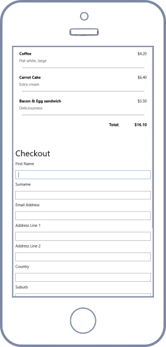
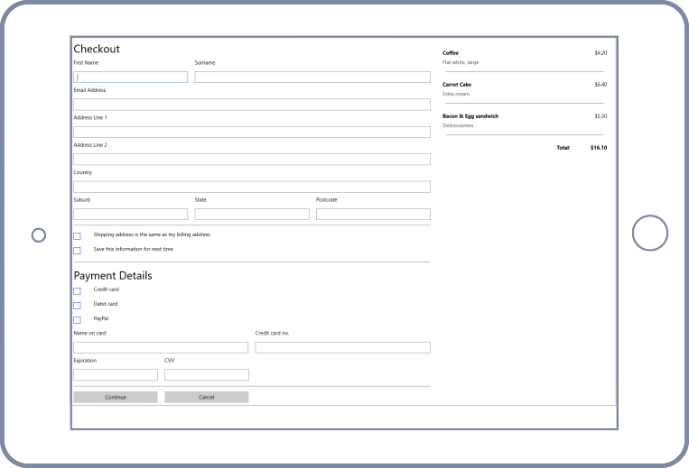
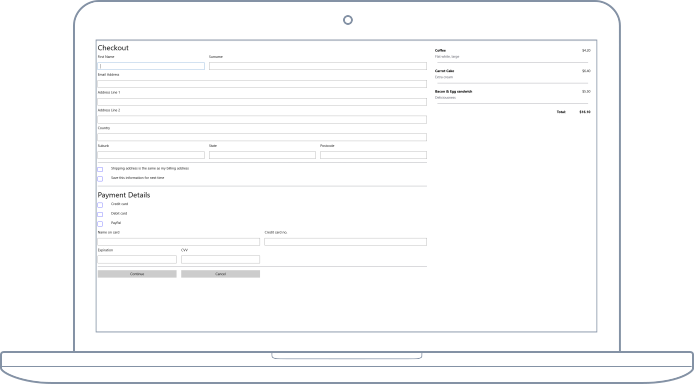

# Introduction

Devices come in all sorts of sizes. We need a solution to make application development easier when targetting solutions that support devices ranging from mobile to desktop devices.

Here is a responsive grid inspired by the original responsive grid from [Twitter Bootstrap](https://getbootstrap.com/docs/4.0/layout/grid/). It will allow you to create a single solution with a single layout that responds when opened from a Mobile, Tablet or Desktop, or when the window is resized small to large.







# Getting started

Install from package manager

```
Install-Package Xamarin.Responsive
```

Install from dot cli

```
dotnet add package Xamarin.Responsive
```

# Responsive Breakpoints

Layout is managed base on the the View Size of the main application's window. Just like Bootstrap's responsive grid we define a layout as being:

-   Extra small (Xs) - Application windows with a width <= 576 pixels
-   Small (Sm) - Application windows with a width > 576 pixels but <= 768 pixels
-   Medium (Md) - Application windows with a width > 768 pixels but <= 996 pixels
-   Large (Lg) - Application windows with a width > 996 pixels but <= 1024 pixels
-   Extra Large (Xl) - Application windows with a width > 1024 pixels

# Import Xamarin.Responsive namespace

Import the responsive namespace into your XAML.

```
<ContentPage
    xmlns="http://xamarin.com/schemas/2014/forms"
    xmlns:r="clr-namespace:Xamarin.Responsive;assembly=Xamarin.Responsive">
    ...
</ContentPage>
```

# Samples

## Simple - Mobile to Large Devices

Mobile devices display full width (12 or 12 columns).
Small devices display half width (6 of 12 columns).
Medium devices display third width (4 of 12 columns).
Large devices display one quarter (3 of 12 columns).

```
<ContentPage xmlns="http://xamarin.com/schemas/2014/forms"
             xmlns:x="http://schemas.microsoft.com/winfx/2009/xaml"
             xmlns:d="http://xamarin.com/schemas/2014/forms/design"
             xmlns:mc="http://schemas.openxmlformats.org/markup-compatibility/2006"
             xmlns:r="clr-namespace:Xamarin.Responsive;assembly=Xamarin.Responsive"
             mc:Ignorable="d"
             x:Class="XamarinResponsive.Samples.SimplePage">
    <ContentPage.Content>
        <r:Container>
            <r:Row>
                <Label
                    r:Row.Column="12,6,4,3"
                    Text="A Responsive Label"/>
            </r:Row>
        </r:Container>
    </ContentPage.Content>
</ContentPage>
```

## Setting individual columns settings

By default all controls will use the width of 1 of 12 columns. If we want a control or label to fill the width on our screen when rendered on a phone, but fill only 25% of the screen otherwise (medium to extra large devices).

```
<r:Container>
    <r:Row>
        <Label
            r:Row.Xs="12"
            r:Row.Md="4"
            Text="Name" />

        <Entry
            r:Row.Xs="12"
            r:Row.Md="8" />
    </r:Row>
</r:Container>
```

## Changing number of columns in Container

By default the grid is 12 Columns, you can change this in the Container control.

```
    <r:Container Columns="4">
        ...
    </r:Container>
```

## Responsively set control properties

Control properties such as Text, Visiblility can be set responsively.

eg.

-   Setting the text of a Label

```
    <Label>
        <Label.Text>
            <r:OnViewSize
                x:TypeArguments="x:String"
                Lg="Large"
                Md="Medium"
                Sm="Small"
                Xl="Extra Large"
                Xs="Extra Small"
            />
        </Label.Text>
    </Label>
```

-   Setting the margin

```
    <Label Text="Margin Changes on View Size">
        <Label.Margin>
            <r:OnViewSize
                x:TypeArguments="Thickness"
                Xs="10,10,10,10"
                Sm="20,20,20,20"
                Md="30,30,30,30"
                Lg="40,40,40,40"
                Xl="50,50,50,50"
            />
        </Label.Margin>
    </Label>
```

-   You can default a Value and Selectively set values for specific View Sizes.

```
    <Label>
        <Label.Text>
            <r:OnViewSize
                x:TypeArguments="x:String"
                Default="Hello World!"
                Xl="Your device is extra large"
            />
        </Label.Text>
    </Label>
```

## Aspect Ratio

Maintain a specific aspect ratio for a control.

```
<Grid>
    <Grid.RowDefinitions>
        <RowDefinition Height="auto" />
    </Grid.RowDefinitions>

    <r:AspectRatio Ratio="4,3">
        <Label Background="Green" Text="4:3 Aspect Ratio" />
    </r:AspectRatio>
</Grid>
```
